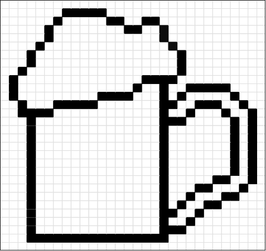

# PINT

**Current version:** 0.6.9.1


PINT is an IMC/CyTOF viewer for image loading, normalization, mask visualization, and neighborhood analysis.

## Installation

### 1. Make sure Git is installed

```bash
Windows:
conda install -c conda-forge git

Linux:
sudo apt install git / brew install git

MacOS:
brew install git
```

### 2. Clone the repo from github and install
```bash
git clone https://github.com/BWvanOs/PINT.git
```

Go to the folder you downloaded pint into and install it:

```bash
cd PINT
conda env create -f environment.yml
conda activate pint
pint

```

### 3. Install an update or a specific version 
To update to the newest version on the main branch:
```bash
cd /path/to/PINT
git checkout main
git pull
conda activate pint
conda env update -n pint -f environment.yml --prune
```

Download a specific version (e.g. version 0.6.1)
```bash
git clone --branch v0.6.1 https://github.com/BWvanOs/PINT.git
cd PINT
conda env create -f environment.yml
conda activate pint
pint
```

Or rollback to an older version if the new one is giving problems
```bash
cd /path/to/PINT
git fetch --tags
git checkout v0.6.0
conda activate pint
conda env update -n pint -f environment.yml --prune
pint
```

## Contents
1. What is PINT?
2. What PINT is NOT!
3. File types and concepts used in PINT
4. Recommended workflow: image handling
5. Recommended workflow: image processing (PINT)
6. Image processing explained. 
7. Recommended workflow: making composite images
8. Thumbnails


## 1) What is PINT?
PINT is a Python/Shiny application designed primarily for Imaging Mass Cytometry (IMC) data. It combines several tasks that otherwise tend to require separate programs or custom scripts:
- load IMC images from MCD exported OME-TIFF files;
- inspect Standard BioTools MCD files and load selected acquisitions directly;
- export panoramas contained in MCD files
- visually inspect individual channels;
- apply configurable image-processing steps;
- process/export stacked images;
- create multichannel color composites;
- run Mesmer cell segmentation through a separate DeepCell environment;
- quantify marker intensities per segmented cell;
- perform PCA, Leiden clustering and PaCMAP visualization;
- annotate clusters and subclusters;
- visualize labeled cell masks together with cell annotations;
- calculate physical cell-cell touching relationships;
- estimate chance-corrected cell-cell interactions by permutation;
- perform a PERMANOVA analysis on interaction profiles;

It connects the seperate worksflow into one comprehensive package

## 2) What PINT is NOT!
PINT automates many operations, and attempts to streamlime start to finish analysis of IMC images. However, it does not decide whether your biology is correct.
The user remains responsible for correct data aqcuisition and inteprestation of biology.
Some importants things to remember:
- Image processing can make images easier to inspect but cannot rescue a poor acquisition.
- Over processing of images can result in wrong data interpretation
- Segmentation is an estimate of cell boundaries and should always be visually inspected after.
- Leiden clusters are numerical groups, not automatically biological cell types. Inspect your clusters carefully
- PaCMAP is a visualization, not a statistical test.
- A statistically enriched neighborhood interaction does not prove a direct molecular interaction between the two cell types. 
- PINT does not remove the need of an appropriate downstream statistical design.

## 3) File types and concepts used in PINT
### 3.1) MCD file
An MCD file is a container produced by Standard BioTools/Fluidigm IMC software. A MCD file can contain more than one slides and multiple panoramas/ROIs. PINT can inspect the MCD files without loading the images. It can display the acquisitions in a table, load selected ROIs into PINT or export selected ROIs as OME-TIFF files and panoramas as PNG files.
### 3.2) OME.TIFF
An OME.TIFF is an TIFF with extra meta data. It normally contains a stack of channels and represents one ROI. PINT expects all images that are loaded to have the same stack of channels in the same order.
### 3.3) Channel
PINT defines a channel as a singel marker/isotope combination. 
### 3.4) Cell masks
A cell mask is a labeled two-dimensional TIFF. Background is label 0. Each cell has a positive integer label, for example 1, 2, 3, ... . Every pixel belongings to either a cell or the background. PINT generates these masks through Mesmer but accepts exported masks from other tools such as cellprofiler.
### 3.5) Permutation test
A permutation test creates an random distribution by shuffling labels. For PINT's touching analysis, the physical touching graph (which cell interacts with which cell) stays fixed while cell cluster labels are shuffled within each sample. This will provide information on whether a cluster-cluster interaction occurs more or less often than a random distribution of cluster labels.

## 4) Recommended workflow: image handling
Open "Image Handler" --> "Image loading"

### Standardize MCD channel names
Up top the checkbox "Standardize MCD channel names" is checked by default.

Different image sources can encode channel names differently. For example, an MCD and an exported OME-TIFF may use slightly different marker/metal formatting. PINT includes channel-name normalization to isolate the name of the marker from the other information to keep the biological name consistently where possible. Uncheck if the channel names to not correspond to your expectation. This leaves the original channel names.
### Load OME-TIFFs
Either directly paste the pathname of your OME-TIFF folder or click the load OME-TIFF folder button to select the fodler that contains your images.

### Load MCD files
PINT can directly load MCD files. Click the Open MCD file(s) to open one or more at the same time. Selecting multiple MCD files at the same time is supported
You can then either manually select the images you want or choose to select them all. You can load these images directly into PINT or export them as OME-TIFF
To export panoramas contained in the MCD files is possible through "Export panoramas". The optional checkbox will allow you to only export panoramas from MCD files that have ROIs selected

## 5) Recommended workflow: image processing (PINT)
Open "Image Handler" --> "PINT"

The left side contains processing controls and options to import and export channel parameter CSV's. The parameters are stored separately
for each channel and can be viewed by opening the collapsable menu with the tiny arrow on the top left of the program.
Each channel has its own setting for:
- winsorization;
- absolute thresholding;
- fraction-of-maximum thresholding;
- noise removal;
- arcsinh transformation;
- normalization and normalization scope.

The right side contains the buttons to switch Samples and Channels and the viewer that displays the images with the current processing settings.

### Updating the channel settings
Changing a number in the interface does not mean that every channel receives that setting. Use the corresponding Update/Apply button to write the current control values to the selected channel's row.
This design lets you use different preprocessing for, for example, a strong nuclear channel and a weak membrane marker. In this way each channel can be processed seperately

Note: If you don't press "Update channel" within the specific pre-processing card it will not save the settings and revert back to the last one. This is intended behaviour

### Import CSV/ Export CSV
"Export CSV" saves the current parameter table.
"Import CSV" reloads a previously saved table and validates/coerces it to the current schema. It will recognize the same panel in a different order.

Use this for:
- reproducibility;
- applying an established processing recipe to another run;
- keeping parameter sets with a project;
- editing values outside PINT if necessary.
- saving your process to continue later

### Process images
"Process Images" runs the batch image-processing/export workflow using the saved parameter settings, rather than only rendering the currently selected preview.
It will save the normalized images within the folder they were loaded from.
It wil NOT touch your original images and rather saves normalized copies.

### Push loaded images to Segmentation tab
This transfers the currently loaded image dataset into the Segmentation workspace. It is a hand-off inside the same running PINT session; it does not save your normalized images
It wil NOT touch your original images

### Recommended practices
1. Load representative images.
2. Tune each channel while visually inspecting several ROIs.
3. Export the parameter CSV before batch processing.
4. Give the file a clear project/version name.
5. Keep it together with the processed image outputs.

## 6) Image processing explained. 
~Always compare the processed image to the raw signal.~ 

With any of these settings it's possible to create biology that isn't actually there or erase real signal!

PINT applies the image-processing operation in a fixed order:
1. Winsorization
2. Absolute thresholding
3. Fraction-of-maximum thresholding
4. Sliding-window speckle/noise suppression
5. Arcsinh transformation
6. Min-max normalization

### Winsorization
Default settings:

    - Lower quantile: 0.00
    - Upper quantile: 0.990
    - Apply winsorization: ON

- 0.990 means the brightest approximately 1% of pixels are clipped to the 99th percentile value.
- More aggressive clipping can improve display contrast but can also erase real intensity differences, so be careful.

Winsorization clips extreme pixel intensities rather than deleting pixels. Pixels above the selected upper quantile are set to the upper cutoff; pixels below the lower quantile are set to the lower cutoff.  

A few extremely bright pixels (which can be noise or biology) can dominate the display range and force your actual staining close to zero after min/max normalization. Clipping those outliers preserved the actual signal. PINT additionally protects the upper winsor bound (so the upper quantile) with a minimum value in the processing code. This value is slightly above the expected noise range of the hyperion itself. This was introduced to reduce the risk that a very sparse marker has its true positive signal pished into the background when the chosen quantile is larger that the fraction of actual positive signal.

### Absolute thresholding
Default settings:

    - Absolute threshold: 1
    - Apply: ON

Pixels below the threshold set by the user are set to zero.

This is useful when you have a physically meaningful low-count background level. It is called "absolute" because the cutoff is expressed in original pixel-intensity units at this stage of the pipeline.

### Percentage thresholding
Default settings:

    - Fraction of max: 0.1
    - Apply: OFF

If enabled, the threshold is: threshold = fraction x maximum pixel value

and pixels below that value become zero.

This is RELATIVE to each image's maximum (so this is a per image setting where the absolute version is global) and therefore can behave very differently between images with different maximum intensities. For most IMC workflows, absolute thresholding is easier to interpret and much more effective in removing background signal.

### Sliding Window Noise Removal
Default settings:

    - Denoise strength: 0.1
    - Window size: 3
    - Apply noise removal: ON

This step suppresses isolated bright pixels using local pixel intensity information. Internally, the strength is converted to a local percentile and the algorithm considers the pixels in the surrounding window.

As IMC images can contain isolated high-intensity speckles that are unlikely to represent actual staining. Window size should normally be an odd integer such as 3 or 5 (safeguard against even values is present)

Be conservative. Very strong denoising can remove genuine small structures or weak punctate staining. Currenly, high Denoising strength can leave holes in hetegenous, but bright patches. This is unintended behaviour.

### Arcsinh transformation
Default settings:

    - Arcsinh transform: OFF
    - Cofactor: 5

Transformation:

    - arcsinh(x / cofactor)

Conceptually, arcsinh transformation behaves (approximately) linearly close to zero and more log-like at high values. It is very commonly used for cytometry-style intensity data because zero values remain well defined while differences in the upper intensity range are amplified.

Smaller cofactors make the transformation become nonlinear sooner. The best cofactor depends on the data scale and intended use. Small cofactors can increase background noise quite a bit.

### Normalization
Default settings:

    - Normalize channel: ON
    - Normalize using: Per page

Min-max normalization maps values into the approximate range 0 to 1:

    - normalized = (x - minimum) / (maximum - minimum)

Two scopes are supported:

PER PAGE
    Each image channel is normalized using its own minimum and maximum. Brightness across the channel is thus not considered
    Advantage: strong visual contrast for each ROI.
    Disadvantage: the same normalized value does not necessarily represent the same original intensity in different ROIs. Comparing staining intensities between images from the same channel is no longer possible. 

GLOBAL MIN/MAX
    PINT computes common limits for that specific channel across loaded all samples and uses the same limits for every sample.
    Advantage: preserves cross-sample intensity comparability better. Makes it possible to compare staining intensities.
    Disadvantage: one unusually bright sample can compress the visible range of all others, depending on the preceding processing choices.

For visual inspection only, per-page normalization is often convenient. For quantitative cross-sample comparison, carefully consider whether normalization is appropriate at all and how it interacts with downstream measurements. Consider if differences in staining intensity actually represents biological differences or are caused by something else.

## 7) Recommended workflow: making composite images
Open "Image Handler" --> "Image creator"

This tab is used to create example stainings for example for your publication or presentation.

The creator uses PROCESSED image channels. It can combine multiple grayscale channels into a color composite using screen blending. 
Each row contains: Channel, Preset, Custom (color), Gain

- Channel: select a processed marker channel.
- Preset: choose one of the built-in colors.
- Custom: Pick/type a custom #RRGGBB hex color.
- Gain: Multiply the contribution of that channel. Gain > 1 makes the channel more prominent; gain < 1 reduces it.

The creator support multiple empty slots. Selecting >>Leave empty<< will completely ignore that slot.

"Reset creator channels" returns the creator selection to its reset/current starting state if your current choices have become inconvenient.
"Save composite TIFF" saves the composite for the currently selected sample.
"Export composite TIFF for all images" Uses the same composite settings for every loaded image, which is useful for a consistent figure set or when you want to check your images for interesting features.

Be careful intepreting the images, A composite is just a visualization. Screen blending, color choice and gain all affect how the staining looks. So again, use this jsut as a visualization!

## 8) Thumbnails
Open "Image Handler -> Thumbnails"

This tab will give you a quick comparison of your stainings across samples or channels.

Two display modes are available: 
- "All channels from one image", useful for reviewing an ROI and spotting bad channels, contamination or staining patterns.
- "One channel from all images" useful for checking how one marker behaves across the whole dataset and identifying sample-to-sample variation

To reduce RAM usage, thumbnails are downscaled to ~1 Mpixel INT8 arrays. 

Two downscaling methods are available:
- Signal preserving — maximum pooling: small bright structures are more likely to remain visible. Good for sparse punctate signal or thin structures.
- Smooth overview — area averaging: averages source pixels into the thumbnail. Produces a smoother, less noisy overview but can dilute tiny bright features.

Thumbnails are not generated upon loading the images and are only generated on demand. You can either generate them per image/channel with "Generate thumbails" or generate them for all channels/images using "Generate all thumbnails" 

Thumbnails are cached and will be retrieved from cache if possible.

To delete all thumbnails in the cache, use "Clear thumbnails"

